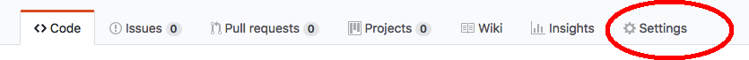

```{r setup, include=FALSE}
knitr::opts_chunk$set(echo = TRUE)
```

This will show you how to make a very simple website with R Markdown and put that online via GitHub Pages.  When you are ready to learn more go to the [Links](links.html) page for more tutorials.

## Download a template

Go to the [RVerse-Tutorials\Test-Website](https://github.com/RVerse-Tutorials/Test-Website) repository and click the Fork button in the upper right.  You will need to be logged into your GitHub account.
 
[Watch a video of this step](https://youtu.be/xeeKrGuaFRg)

Or you can download a zip file of the repository.  To do the latter, you can use the 'download zip file' button on the GitHub repository or you can navigate to your 'RWorkflow' folder in RStudio and click 'More' in the Files panel and select 'Set as working directory'. Then issue these commands.

```
library(RWorkflowsetup)
download.repo("Test-Website")
```

*INCOIS participants: You will find a copy of the repository in the RWorkflow directory that you copied from the thumb drive.*

## Build the website

1. Open RStudio and 'New Project' in the upper right.  Then select 'From Existing Directory' and select the 'Test-Website' directory.

2. From RStudio, click 'Build' from upper right and then 'Build Website'.  Your website should open.  You can select 'View in browser'.

  - You can also right click on 'index.html' from the files, and select 'open in browser'.
  
[Watch a video of this step](https://youtu.be/94iHk0UnxJc)

## Overview

There are two required files for a website plus your content (your R Markdown files).

The first required file is `_site.yml` which is your configuration file.

The second required file is `index.Rmd` which is your landing page or page #1.

Your content is specified in additional R Markdown files.  Not required, but your website is not very interesting without content.

## _site.yml

The `_site.yml` specifies the basic info about your site and the navigation bar at top.

```
name: "my-website"
output_dir: "."
navbar:
  title: "My Website"
  left:
    - text: "Home"
      icon: fa-home
      href: index.html
    - text: "About"
      icon: fa-bullhorn
      href: about.html
      menu:
        - text: "Page A"
          href: page_a.html
        - text: "Page B"
          href: page_b.html
output:
  html_document:
    theme: readable
    toc_depth: 3
    toc_float:
      collapsed: false
```

## index.Rmd

`index.Rmd` is just your landing page.  You can have as little or as much content as you want here.  When readers click on your site, they will see this page first.

A minimal `index.Rmd` would look like:

```
---
title: "My website"
---

Here is my website.
```

## Content

You can now add as many Rmarkdown files as you want for your content.  Each one will be processed into an html file.  For example in `Test Website`, we have two files, `about.Rmd` and `contact.Rmd`.  Your Rmd files should have the yaml at top and then your Rmarkdown content.

Here is a simple example.

```
---
title: Simple Rmd File
---

Here is a simple file.
```

`about.Rmd` is a fuller Rmd file with R code and figures.

If you want the file linked to in your top nav bar, then add it to `_site.yml`.   

```
name: "my-website"
output_dir: "."
navbar:
  title: "My Website"
  left:
    - text: "About"
      href: about.html
    - text: "Contact"
      icon: fa-user-circle
      href: contact.html
output:
  html_document:
    theme: readable
    toc_depth: 3
    toc_float:
      collapsed: false
```

## Make your website live

[Watch a video of this step](https://youtu.be/eHWi5XmTO8U)

Here is how to make your website live on GitHub.

First you need to add this as a repository on GitHub.

1. Open GitHub Desktop and select File > New Repository.  Type 'Test-Website' (or if you renamed it, then whatever you renamed it to).  Leave everything else blank (for now).

2. This adds your repository to GitHub Desktop.  Now click 'Publish' in the top right corner.  If 'private' is checked, uncheck that.

Next you need to open your repository on GitHub and set it up to serve a webpage.

1. Go to your GitHub account.
2. Click on the new Test-Website repository.
3. Click on Settings.

4. Scroll down to GitHub Pages and change source from 'none' to 'master branch'.

5. Wait a few minutes and then go to your new webpage.  The link will appear just above where your changed the source.

## Extras

### Table of Contents

If you want to see table of contents for your Rmd files, you specify toc properties in your `_site.yml` file.

```
output:
  html_document:
    theme: readable
    toc_depth: 3
    toc_float:
      collapsed: false
```

and specify `toc: true` in your yaml at the top of your Rmd file.  

```
output:
  html_document:
    toc: true
```

See the `about.Rmd` file for an example.

### Themes

Your `_site.yml` file has a line that specifies the theme.

```
output:
  html_document:
    theme: readable
```

The following are automatically available to you: bootstrap, cerulean, cosmo, flatly, journal, lumen, paper, readable, sandstone, simplex, spacelab, united and yeti.  Try changing the theme to one of these and rebuilding your website.

You can download other bootstrap css files and put in site_libs if you want other themes.  Do a search for 'bootstrap themes free'.

### Icons

You can easily add icons to your navigation tabs.  The `icon:` line specifies the icon.  See the FontAwesome website for icons available.  Put `fa-` in front of the name.  For example a photo icon would be specified `fa-picture-o`.

```
  left:
    - text: "Set-up"
      icon: fa-picture-o
      href: setup.html
```

### Customizing

You can add your own css file to customize the html.  Add to your `_site.yml` file:

```
output:
  html_document:
    theme: cosmo
    highlight: textmate
    include:
      after_body: footer.html
    css: styles.css
```

And then add a `styles.css` file to your folder.  You can change all the h1 headers to green.

```
h1 {
  font-color: green
}
```

Change the font-family and add some more space.

```
body {
    font-family: "Helvetica Neue",Helvetica,Arial,sans-serif;
    line-height: 2;
}
```

Add more spacing between the sections.

```
.section {
   padding-bottom: 2em;
}
```

Etc, etc, etc, etc.

### Fixing a navbar that wraps

The bootstrap css doesn't handle navbars with many tabs very well.  It wraps and covers up the text.  Adding the following to your `styles.css` file will fix that.

```
/* Need to adjust the navbar behaviour so the navbar doesn't wrap */
.navbar-nav { 
  position: fixed;
  left: 150px;
  width: 700px;
}

.navbar-header {
  position: fixed;
  left: 30px;
  width: 97%;
}
```
