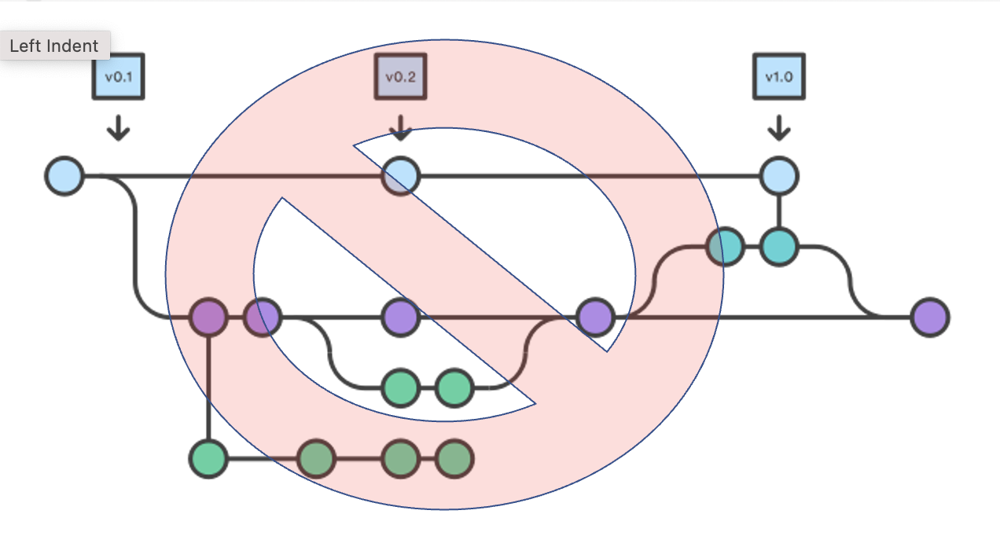
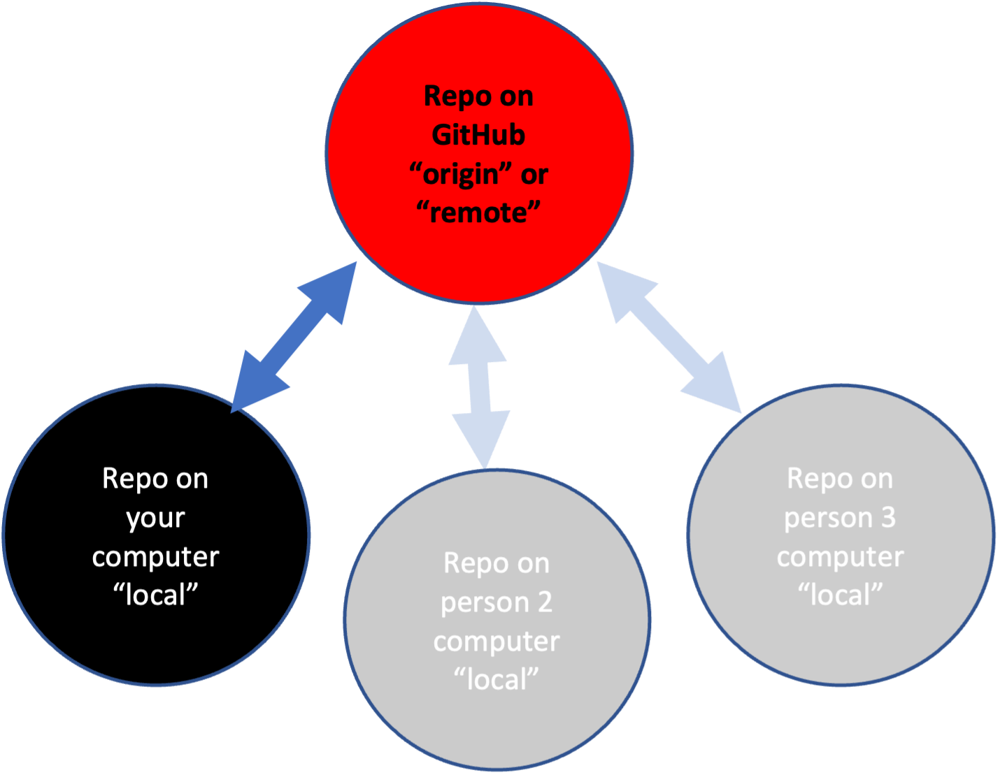
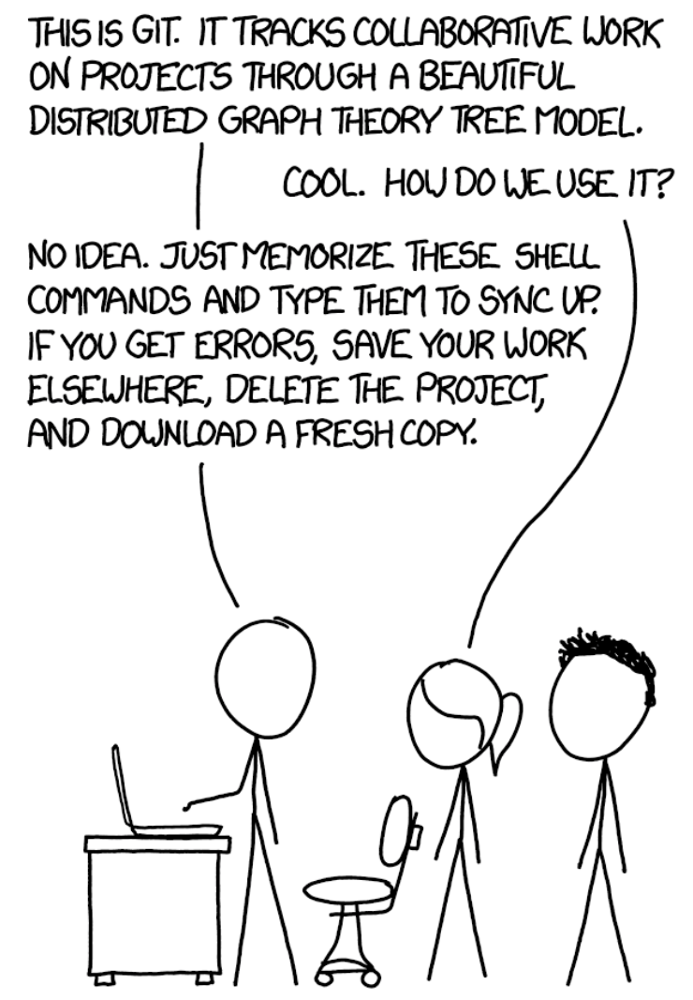
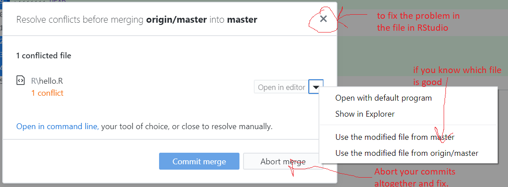

```{r setup, include=FALSE}
knitr::opts_chunk$set(echo = TRUE)
set.seed(1234)
```

<table style="background-color: blue; width: 100%;">
<tr>
<td style="text-align:left; padding:5px;"><a style="color:white" href="http://nmfs-openscapes.github.io">NMFS Openscapes</a>
</td>
<td style="text-align:center; padding:5px;"><a style="color:white" href="https://github.com/nmfs-openscapes/.github/wiki">Wiki</a>
</td>
<td style="text-align:right; padding:5px;"><a style="color:white" href="https://nmfs-openscapes.github.io/NMFS-R-UG/">NMFS R User Group</a>
</td>
</tr>
</table>
<br>

# What is Git and GitHub?

**Git** A program to track your file changes and create a history of those changes. Creates a 'container' for a set of files called a repository.

**GitHub** A website to host these repositories and allow you to sync local copies (on your computer) to the website. *Lots* of functionality built on top of this.

## Some basic Git jargon

* **Repo** Repository. It is your code and the record of your changes. In a hidden folder called `.git` (so if you wanted to get rid of the history and other Git info, you could delete that folder). You have a local repo and a remote repo (on GitHub).
* **Commit** Write a note about what change you made to a file and "commit" that note to the repository record.
* **Push** Push local changes up to a remote version of the repository on GitHub
* **Pull** Pull changes on GitHub into the version of the repository on your local computer
* **Git GUIs** A graphical interface for Git (which is command line). There are [many](https://git-scm.com/downloads/guis). I am teaching an easy-entry one, [GitHub Desktop](https://desktop.github.com/). The lecture notes have videos of me using other ones.

# Overview

Today I will cover the basic Git/GitHub skills (and info) that are all most people need for 95% of their work. I am using [GitHub Desktop](https://desktop.github.com/). ^[**Why GitHub Desktop?** I teach using it because it is made by GitHub and all you have to do is download and login with your GitHub account. No hassles for students. I personally use it because my Git and GitHub work is simply much faster using it. I have many GitHub repos so speed and being able to track multiple repos is important to me. Also I use GitHub issues to plan and track my work. Being able to type '#' in my commit message and see what issues are open on GitHub is critical for my workflow. Other people use RStudio's Git GUI but it doesn't have the functions I need. I also like GitKraken. Search around and find something that works for your purposes. In JupyterLab I use the jupyter-git extension.] If you want to use Git from RStudio, [go to set-up](set-up.html) and scroll to the section on RStudio and Git. 

Simple Trunk-based Workflow:

* Make local (on your computer) changes to code.
* Record what those changes were about and commit to the code change record (history).
* Push those changes to your remote repository (aka origin)

We'll do this


Not this, i.e. what you would probably see if you Google "Git". ^[ Note, if you decide later on to start using branches, then read up on Gitflow (the second figure) versus trunk-based (the first figure) development styles:   [here](https://www.toptal.com/software/trunk-based-development-git-flow) and [here](https://www.atlassian.com/continuous-delivery/continuous-integration/trunk-based-development). The development styles with lots of branching (and branches on branches) are known for merge conflict headaches.]

{width=400px}

# Set-up

I'll be using GitHub Desktop for the lecture. The first time you use it, you will need to 

* Open GitHub Desktop > Preference > Accounts and log into your GitHub account
* Open GitHub Desktop > Preference > Git and add your name and email

[Show me](https://youtu.be/94Pp6JgDAzc)

*Not using GitHub Desktop?* Then you need to do this from the shell [Show me how](https://youtu.be/4xrp_AZuyEo). RStudio users could also do this from the R command line; [Read how](https://rverse-tutorials.github.io/RWorkflow-NWFSC-2022/set-up.html#Git_from_RStudio_Desktop)

# The Key Skills

Repository skills (using GitHub Desktop)

* Skill 1: Create a blank repo on GitHub
* Skill 2: Clone your **GitHub** repo onto your computer
* Skill 0: Open your repository in your editing platform. 
* Skill 3: Make some changes and commit those local changes
* Skill 4: Push local changes to GitHub

* Skill 1b: Clone someone else's GitHub repository

{width=200px}

# Let's see it done!

## Skill 1: Create a blank repo on GitHub

1. Click the + in the upper left from YOUR GitHub page.
2. Click new and add the Readme file and `.gitignore`

[Show me](https://youtu.be/1uV_7iGVu3o)

## Skill 2: Clone your repo to your computer

1. Copy the URL of your repo. `https://www.github.com/yourname/yourrepo`
2. Open GitHub Desktop on your computer. Click File > Clone Repository
3. Click URL in the box that pops up and paste in the URL above
4. Double check that you are saving the repo in the right place

[Show me](https://youtu.be/oFGI48PMEf8) --
[Show me with the shell](https://youtu.be/7PN-yz9g134) -- [Show me with RStudio](https://youtu.be/EerAPZi9UCo) -- [Show me with Visual Studio Code](https://youtu.be/aMPGKMRjl8A)


## Skill 3: Make some changes and commit your changes

1. Make some changes to a file or add a file. **Make changes however you want.**
2. Open GitHub Desktop, click the little checkboxes next to the changes.
3. Add a commit comment, click commit.

[Show me](https://youtu.be/wdVEGGreUhI) -- [Show me with the shell](https://youtu.be/SLuQnRVx7Dk) -- [Show me with RStudio](https://youtu.be/Bc0tvZJa4fI) -- [Show me with Visual Studio Code](https://youtu.be/jMWvLk9iuFw)

## Skill 4: Push changes to GitHub / Pull changes from GitHub

To push changes you committed in Skill #3

1. In GitHub Desktop, click Push at top to push the changes to GitHub

To pull changes on GitHub that are not on your local computer:

1. Make some changes directly on GitHub
2. Click Pull in GitHub Desktop

[Show me](https://youtu.be/7X7kiMAlvjA) -- [Show me with RStudio](https://youtu.be/PSWNBSOUTVE) -- [Show me with the shell](https://youtu.be/LfjG6GGKRio) -- [Show me with VS Code](https://youtu.be/6dW3oT2Ra4U)

## Skill 1b: Copy a repo on GitHub

You can copy your own or other people's repos^[This is different from forking. There is no connection to the original repository.].

1. In a browser, go to the GitHub repository you want to copy.
2. Copy its url.
3. Navigate to your GitHub page: click your icon in the upper right and then 'your repositories'
4. Click the `+` in top right and click `import repository`. Paste in the url and give your repo a name.
5. Use Skill #1 to clone your new repo to your computer


## Skill 1c. Use an existing repository as a template for something new

Let say you want to make a copy of one of your GitHub repositories and use it as a template to make something brand new.

1. Import/copy the repository that you will be building off of to GitHub using Skill 1b.
2. Once you have the copied repository, copy its url and use Skill #2 to clone that repository onto your computer
3. Get rid of any files you don't want in the new repo and use Skill #3 to commit those changes and then Skill #4 to push the changes up to GitHub.

<hr>
<div style="background-color: grey;">
**END OF MATERIAL COVERED IN WEEK 1 LECTURE**

**Below is supplemental information**
</div>
<hr>

# Other skills

## Make an existing folder on your computer a GitHub repository

1. Use Skill #1 to create a blank repo on GitHub and clone onto your computer
2. Copy the files you want to your new repository folder
3. Use Skill #3 to commit those changes
4. Use Skill #4 to push those to GitHub

Note there are some easier ways to do this but the above is how to do it with your Skills 1-4. Also in my experience the other 'easier' ways have a tendency of creating problems for beginners.

# Definitions

## Forking versus Cloning versus Importing/Copying

Forking is if you are contributing to someone else's repository (the 'upstream' respository). Your fork is another separate origin repository on GitHub but it 'knows' the upstream repository and you can easily pull in changes from it and you can make a pull request to push your changes to the upstream repository. You don't push directly to the upstream repository.

Cloning makes a local copy of a respository on GitHub. The clone is connected directly to the origin repository on GitHub and you push directly to the origin.

Importing/Copying is if you want your own copy of the repository because you want to make your own version of the code or use it as a starting point for your own project. The copy is not connected to the original repository.

## Merge conflicts

Merge conflicts happen when there are changes to a file on your origin repository (GitHub) but also changes to that same file on your local repository. Git doesn't know how to resolve the conflicting changes and needs your help. GitHub Desktop will warn you and give you some helpful options to resolve these.

## Branches

A copy of your repository that you can work on without changing the main branch of the repository. Once you are done, you incorporate the changes into the main branchg. **Beginners should steer clear of branches** until they feel confident with Git and GitHub. I maintain many repositories and use branches on only 2 of them.

If you decide later on to start using branches, then read up on Gitflow  versus trunk-based development styles:   [here](https://www.toptal.com/software/trunk-based-development-git-flow) and [here](https://www.atlassian.com/continuous-delivery/continuous-integration/trunk-based-development). The development styles with lots of branching (and branches on branches) are known for merge conflict headaches.


# Review: A workflow to minimize headaches

* Open GitHub Desktop
* Do a pull from GitHub
* Work
* Commit changes
* Push changes up to GitHub

# Collaborating without merge conflicts

* Communicate! Software development teams check-in daily (daily stand-up) so they know what each person is doing.
* Don't work on the same files at the same time. *How would I know?* Talk with your teammates!
* Work in smaller pieces or different sections. **Short iterations**.
* **Don't leave your code broken** as a general rule. If you are doing that regularly, practice smaller pieces of work.

# More Git skills

{width=200px}

## Tips to be aware of:

* How to issue a Git command in a terminal window. 
    * Open a terminal window
    * `cd` to the directory with the repository
    * GitHub Desktop > Repository > Open in Terminal
* Where the Git info is hidden in a repository.
    * In the `.git` folder
* *Time stamps* is something that you probably use to see when a file was **last changed**. Time stamps do **NOT** have that meaning in a Git repository. A time stamp in a Git repository is the last time you did something to the file (cloned repo, switched branches, checked out state of repo at some time in the past, ...). See the Pro tips, if you need last time file changed as your time stamp.

## The one way to destroy content

```
git reset --hard
```

Everything else you do can be recovered. `git reset --hard` actually deletes content forever.

Here's an alternative.
```
git log
```
Look around at the state of your repo at different commits.

```
git reset <some commit hash #>
```
Reset to some past state.

```
git push -f origin main
```
Make the remote match your local state. Note `-f` is `--force` and is a bad thing to do if you are collaborating because you might wipe out the other persons work.


## Getting rid of changes you have made

Say you made a change and you need to get rid of that. The temptation (for me) is to jump onto the Git command line and clobber my repository with `reset` and `revert` commands. Don't do this. Here are some strategies that will make this let prone to leaving your code a mess.

### Have you commited the changes yet?

**No?** Easy click on the file in GitHub Desktop, right click and click 'Discard Changes...'. Note this will take things all the way back to your last commit!! If you have been making a bunch of changes without committing those, then you are out of luck.

**Yes?** Go to History in the GitHub Desktop window, click on the commit and click 'Revert'. This will get rid of all the changes that went with that commit. So if you changed multiple files, all those files will be reverted. If you have pushed the changes to GitHub, then you can push the revert and it'll show up on GitHub too.

### Resolving merge conflicts with GitHub Desktop

GitHub Desktop makes resolving these pretty easy.

1. If it tells you to fetch commits off GitHub, go ahead and do that.
2. Now try to Pull. It'll tell you that you have conflicts and give you options for what to do.



* Click the 'x' and Git will alter `hello.R` and show where the conflicts are. You then edit `hello.R` in RStudio to fix the conflicts.
* If you know what file you want to use, use the little arrow dropdown to use the file on GitHub or on your local machine.
* Use Abort Merge to abandon the merge. Your changes to `hello.R` are still there.
    * Click on History, right click the commit and revert to get rid of it. All file changes that are part of that commit will disappear! You can revert the revert if needed.
    * Go into `hello.R` and fix the conflict. Git won't have marked it so it might be hard to find.
    
## Recovering a single file

Let's say you made a big multi-file commit and you want to revert one file.

You can do this at the Git command line, but I find that to be a huge time suck and in my early Git days, I sometimes left my repository with a horrible problem that I could not fix and had to completely rebuild my repo. Since I don't need to be a Git wizard, this is what I do when I want to go 'back in time' for a single file.

Assuming you have already pushed the changes up to GitHub. 

* Go to the repo on GitHub
* Click 'commits' It's a little icon above your code with a clock with a counter-clockwise arrow.
* Scroll to the commit where the file was in the state you want (one before the last bad commit).
* On the right click the `< >` to browse your repo at the state in time where your file was ok.
* Click on the file and copy the text.
* Go back to RStudio, open the file, and paste in the text from when it was good.

If you have not pushed the changes up to GitHub.

* Now you have to go to the Git command line. Git tab in RStudio and then click the cog > Shell.
* Note, in 9 times out of 10, I would push the commit to GitHub and then use the above copy/paste to avoid using the Git command line. I would find that much faster.

Ok, here's the Git command to get a single file back. This works whether or not you have pushed to GitHub. The problem with this and why I don't do it is that I usually need to look at the file. So I am scrolling back through the status of my repo in the past until I find the status that I want. Then I stare a bit and think and think. Then get a coffee and think some more. Then I scroll back through the status of the repo in the past some more and THEN I do the copy and paste. It is rarely the case that I know exactly what commit that I need to get rid of---and even rarer that I want to go completely to a status in the past.

* Open the a terminal window where you are in the repository
* Use GitHub Desktop to navigate to the commit you want. Right click and 'Copy SHA'
* The command to checkout the version of the file one commit before the bad one is `git checkout SHA~1 -- ./<file name>` For example
* `git checkout 1d0f8c2eb4e66db0a7123588ae2fad26a6338303~1 -- ./R/test.R`  would reset test.R to one before that commit. This part `1d0f8c2eb4e66db0a7123588ae2fad26a6338303` is the bad commit hash and this part `~1` means what the file was like 1 commit before that.

[Show me](https://youtu.be/GmQuL45jnT8)
    
If you accidentally leave off the file name and Git says you have a detached head, use `git checkout master` or `git checkout main` to reattach your head.

## Cleaning up your commit history

I tend to commit constantly as I make little changes to files. If you do that too, you might want to "squash" commits together into one commit that summarizes all the changes. This is easy to do in GitHub Desktop.

* Go to History
* Select the commits you want to squash together
* Right click and select "Squash"

[Show me](https://youtu.be/jklwa0-Wkso)

## Pro tip

*Time stamps* is something that you probably use to see when a file was last changed. Time stamps lose meaning if you use `git checkout` for branches or tags. In fact, in the Git-verse, time doesn't exist since Git workflow is not necessarily linear. I find this very confusing so I purposely work in a linear fashion with Git.

To fix time stamps when you use `git checkout` (i.e. switch branches), you can use a `post-checkout` file in the `.git/hooks` folder.

1. Open `post-checkout.sample`. Save as `post-checkout`
2. Copy this into that file

```
#!/bin/sh -e

OS=${OS:-`uname`}

if [ "$OS" = 'Darwin' ]; then
  get_touch_time() {
    date -r ${unixtime} '+%Y%m%d%H%M.%S'
  }
else
  get_touch_time() {
    date -d @${unixtime} '+%Y%m%d%H%M.%S'
  }
fi

# all git files
git ls-tree -r --name-only HEAD > .git_ls-tree_r_name-only_HEAD

# modified git files
git diff --name-only > .git_diff_name-only

# only restore files not modified
comm -2 -3 .git_ls-tree_r_name-only_HEAD .git_diff_name-only | while read filename; do
  unixtime=$(git log -1 --format="%at" -- "${filename}")
  touchtime=$(get_touch_time)
  # echo ${touchtime} "${filename}"
  touch -t ${touchtime} "${filename}"
done

rm .git_ls-tree_r_name-only_HEAD .git_diff_name-only
```