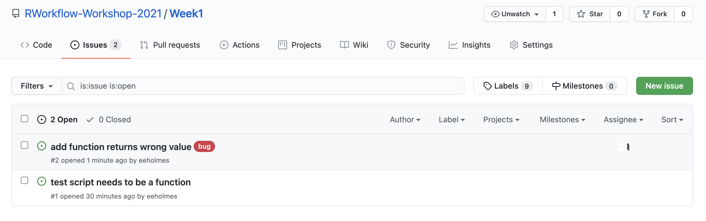
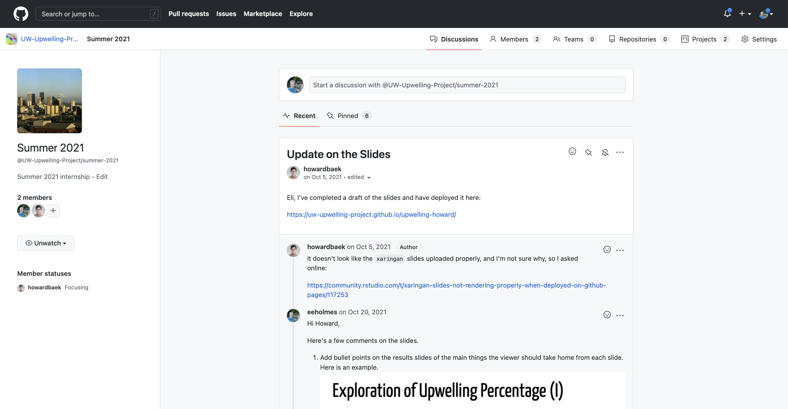
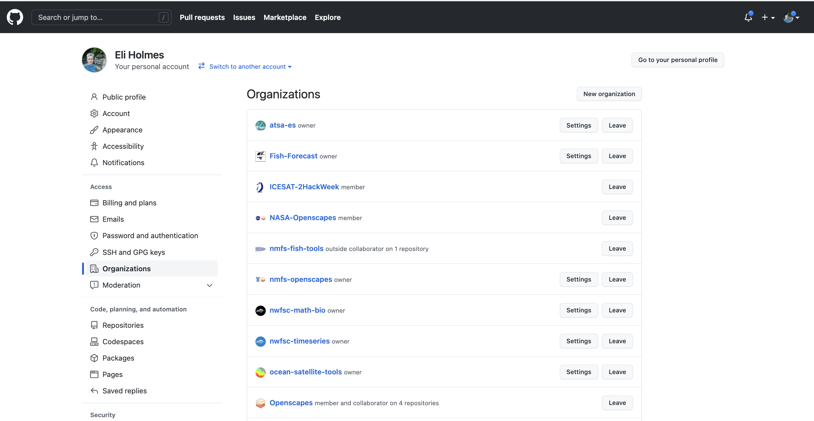
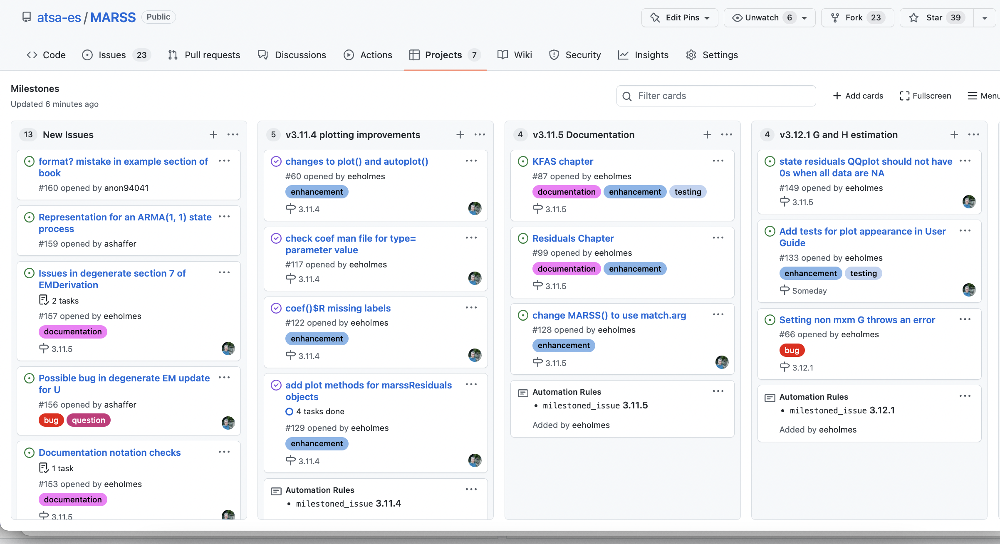

```{r setup, include=FALSE}
knitr::opts_chunk$set(echo = TRUE)
set.seed(1234)
```

<table style="background-color: blue; width: 100%;">
<tr>
<td style="text-align:left; padding:5px;"><a style="color:white" href="http://nmfs-openscapes.github.io">NMFS Openscapes</a>
</td>
<td style="text-align:center; padding:5px;"><a style="color:white" href="https://github.com/nmfs-openscapes/.github/wiki">Wiki</a>
</td>
<td style="text-align:right; padding:5px;"><a style="color:white" href="https://nmfs-openscapes.github.io/NMFS-R-UG/">NMFS R User Group</a>
</td>
</tr>
</table>
<br>


# Overview


This week I will cover key GitHub features and a few more Git skills.

A few more Git skills

* The basics of Git branches
* How to revert changes
* How to deal with merge conflicts
* How to issue a Git command in a terminal window.
* Where the Git info is hidden in a repository.
* [Other useful Git skills](https://rverse-tutorials.github.io/RWorkflow-NWFSC-2022/week1-introtogit.html#Other_skills)

Key GitHub.com skills.

* How to use issues.
* How to use releases.
* How to use organizations---for yourself or a team.

Getting started collaborating using Git and GitHub

* How to set things up in your shared repository in order to work as a small team.


# More Git skills

## Branches 101

As I mentioned in week 1, you should get familiar with the 4 basic Git skills before you start working with branches. You may never need to use branches, but there is one very common use of branches: development branch.  If you are using your GitHub repository to delivery a product like an R package, the main branch needs to stay clean and functional*. In this case, you will need a development branch. * Unless you use releases.


* **Branch** A copy of your repo that you will make changes to and then merge back into the original.

### Basic skills

* Skill 1. Create a branch from main
* Skill 2. Merge a branch back into main

[Show me w GitHub Desktop](https://youtu.be/Nfj-PpsvsuM) - [Show me from the shell](https://youtu.be/jBLsELmtGEA) - [Show me from RStudio](https://youtu.be/3L2MXf-cg3Y) - [Show me from VS Code](https://youtu.be/07PgyheQmBo)

* Skill 3. Update a branch from main*
* Skill 4. Delete a branch

[Show me w GitHub Desktop](https://youtu.be/cbXO63jz3S0) - [Show me from the shell](https://youtu.be/YMdri9bmhGU) - [Show me from RStudio](https://youtu.be/DvKLV-EFUYw) - [Show me from VS Code](https://youtu.be/SV-_tlg0t3Y)

* making changes on main while working on a branch is a common way to run into merge conflicts by the way. [Show me an example of fixing such a merge conflict](https://youtu.be/uu92kFnp7iw)

### Why do branches cause so many headaches?

The skills above are simple, why do branches causes beginners to hate Git?

* A branch is **not** a parallel file folder. Git is rewriting your one set of files.
* Beginners think that switching branches is something done **in** a program (GitHub Desktop, RStudio) rather than something done **to** their file system.
* Beginners do not know to keep track of what branch they are on.
* Beginners are confused when they look at their file folder outside of GitHub Desktop, RStudio or VS Code.

[Show me](https://youtu.be/FNLwsu-sy7E)

* Work you haven't committed yet behaves differently!

The default behavior is that any changes you have not committed will **follow** you when you change branches. This will through you for a loop if you don't know about this. GitHub Desktop will alert you and default is that these changes do **not** follow, but in every other GUI, they follow without warning.

[Show me in RStudio/shell](https://youtu.be/uN_Gx7YIl64) - [Show me in GitHub Desktop](https://youtu.be/o2GAxSl_9nY)

* Beginners use file time-stamps.

[Show me](https://youtu.be/oqhq9GSjNWI)

* Beginners use branches as a kind of sandbox
* They often find themselves wanting to 'pick' a single file from a branch to update*

This approach to branches will lead to headaches. Better to be more methodical and start then finish tasks (code changes) and then delete branches. 

* an easy way to do this is from the terminal: `git checkout branchname filepath` e.g. from main branch
```
git checkout development ./hello.R
```
would replace the file `hello.R` on the main branch with the current version of `hello.R` on the development branch. Note the `./` in the path. *Confession, the following achieves the exact same effect and is 5x faster than trying to remember `checkout` syntax: switch to the branch, copy the contents of `hello.R`, switch back to main branch, and paste in what you just copied.*


## Getting rid of changes you have made

Say you made a change and you need to get rid of that. The temptation is to jump onto the Git command line and clobber the repository with `reset` and `revert` commands. **Don't do this.** Here are some strategies that will make this let prone to leaving your code a mess.

### Have you commited the changes yet?

**No?** Easy click on the file in GitHub Desktop, right click and click 'Discard Changes...'. Note this will take things all the way back to your last commit!! If you have been making a bunch of changes without committing those, then you are out of luck.

[Show me in GitHub Desktop](https://youtu.be/DokyxU8ORWc) - [Show me in VS Code](https://youtu.be/mz-ywBzW5ow) - [Show me in RStudio/shell](https://youtu.be/3J2PlxaBbBE)

**Yes?** Go to History in the GitHub Desktop window, click on the commit and click 'Revert'. This will get rid of all the changes that went with that commit. So if you changed multiple files, all those files will be reverted. If you have pushed the changes to GitHub, then you can push the revert and it'll show up on GitHub too.

**But I need to revert multiple commits!** Work backwards one by one.

Why not use `git reset HEAD~1` or similar? You can. Search Google and you will find many ways to to that. But I warn you that `git reset` is the path to many frustrating hours with Git (see the many StackOverflow questions).

## Recovering a single file

Let's say you made a big multi-file commit and you want to revert one file.

You can do this at the Git command line, but I find that to be a huge time suck and in my early Git days, I sometimes left my repository with a horrible problem that I could not fix and had to completely rebuild my repo. Since I don't need to be a Git wizard, this is what I do when I want to go 'back in time' for a single file.

Assuming you have already pushed the changes up to GitHub. 

* Go to the repo on GitHub
* Click 'commits' It's a little icon above your code with a clock with a counter-clockwise arrow.
* Scroll to the commit where the file was in the state you want (one before the last bad commit).
* On the right click the `< >` to browse your repo at the state in time where your file was ok.
* Click on the file and copy the text.
* Go back to RStudio, open the file, and paste in the text from when it was good.

If you have not pushed the changes up to GitHub.

* Now you have to go to the Git command line. Git tab in RStudio and then click the cog > Shell.
* Note, in 9 times out of 10, I would push the commit to GitHub and then use the above copy/paste to avoid using the Git command line. I would find that much faster.

Ok, here's the Git command to get a single file back. This works whether or not you have pushed to GitHub. The problem with this and why I don't do it is that I usually need to look at the file. So I am scrolling back through the status of my repo in the past until I find the status that I want. Then I stare a bit and think and think. Then get a coffee and think some more. Then I scroll back through the status of the repo in the past some more and THEN I do the copy and paste. It is rarely the case that I know exactly what commit that I need to get rid of---and even rarer that I want to go completely to a status in the past.

* Open the a terminal window where you are in the repository
* Use GitHub Desktop to navigate to the commit you want. Right click and 'Copy SHA'
* The command to checkout the version of the file one commit before the bad one is `git checkout SHA~1 -- ./<file name>` For example
* `git checkout 1d0f8c2eb4e66db0a7123588ae2fad26a6338303~1 -- ./R/test.R`  would reset test.R to one before that commit. This part `1d0f8c2eb4e66db0a7123588ae2fad26a6338303` is the bad commit hash and this part `~1` means what the file was like 1 commit before that.

[Show me](https://youtu.be/GmQuL45jnT8)
    
If you accidentally leave off the file name and Git says you have a detached head, use `git checkout master` or `git checkout main` to reattach your head.

### Resolving merge conflicts with GitHub Desktop

GitHub Desktop makes resolving these pretty easy.

1. If it tells you to fetch commits off GitHub, go ahead and do that.
2. Now try to Pull. It'll tell you that you have conflicts and give you options for what to do.


* Click the 'x' and Git will alter `hello.R` and show where the conflicts are. You then edit `hello.R` in RStudio to fix the conflicts.
* If you know what file you want to use, use the little arrow dropdown to use the file on GitHub (`origin/main`) or on your local machine (`main`).
* Use Abort Merge to abandon the merge. Your changes to `hello.R` are still there.
    * Click on History, right click the commit and revert to get rid of it. All file changes that are part of that commit will disappear! You can revert the revert if needed.
    * Go into `hello.R` and fix the conflict. Git won't have marked it so it might be hard to find.
    
**Those using Git in RStudio** Merge conflicts are a bit of a disaster in RStudio, and RStudio gives no warning before it mucks up your files. So it you are pushing/pulling from RStudio be sure to practice on some toy merge conflicts before you run into a real one.

## Lastly, the main Git commands that cause beginners trouble

* `git reset`
* `git checkout`
* `git branch`

And the commands that will help you

* `git status`
* `git log`
* `git reflog`

# Key GitHub skills

## Issues

* Use the Issues in GitHub to enter any issues (bugs, feature changes, notes).




* Add code to your issue so you can easily recreate the problem.


* You can reference issues in your commits with #<num of the issue>

## Releases

* The release or tag feature in GitHub will help you go back in time and document working states
* Use a NEWS file to keep a notebook of all your major changes.

*Pro tip* checkout the state of the repository at the time of a release. From the terminal:
```
git checkout v1.0
```
When done:
```
git switch -
```

**Warning `git checkout ...` will change all your time stamps.** Might be better to just do this from GitHub...

## Discussion Boards



## GitHub Organizations

I use this to organize collections of repositories.

* Share access to repos across a team
* Have team discussions
* Have a organization landing page



## Project Boards



Example from my work:

* https://github.com/atsa-es/MARSS/projects/5

We'll work with project boards more in Week 3 and 4 when we learn about project management with Kanban and Scrum.


# Additional GitHub features

## GitHub Pages

* From your Readme file
* Making a landing page from RMarkdown using RStudio. Check out [NMFS Openscapes](https://github.com/nmfs-openscapes/nmfs-openscapes.github.io)

## Pro tip: Using GitHub Actions

You may have heard about them. Let's see it in action. We make a GitHub Action that will update our Readme file whenever a relevant change happens. We'll see a bigger example next week with RMarkdown reports.

To set up our action:

* Create a .github folder in our repo
* Create a workflows folder in the .github folder
* Create a file `render-readme.yml` with the instructions for what to do to make the Readme.md file.

Our yml file has a set of instructions to the server that is going to do the work.

```
on:
  push:
    paths:
      - README.Rmd
      - test.csv

name: Render README

jobs:
  render:
    name: Render README
    runs-on: macOS-latest
    steps:
      - uses: actions/checkout@v2
      - uses: r-lib/actions/setup-r@v1
      - uses: r-lib/actions/setup-pandoc@v1
      - name: Install packages
        run: Rscript -e 'install.packages(c("rmarkdown", "knitr"))'
      - name: Render README
        run: Rscript -e 'rmarkdown::render("README.Rmd", output_format = "md_document")'
      - name: Commit results
        run: |
          git commit README.md -m 'Re-build README.Rmd' || echo "No changes to commit"
          git push origin || echo "No changes to commit"
```

* NMFS R User Group GitHub Actions tutorial [here](https://github.com/nmfs-openscapes/12-07-21-GitHub-Actions).
* Fisheries Integrated Toolbox GitHub Actions [here](https://github.com/nmfs-fish-tools/ghactions4r)


