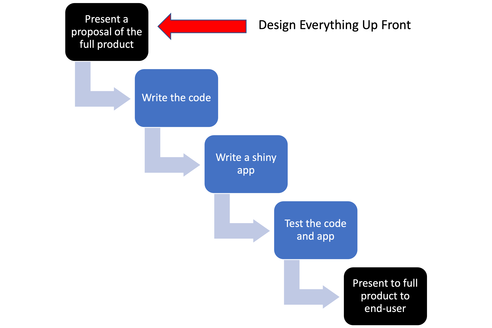

```{r setup, include=FALSE}
knitr::opts_chunk$set(echo = TRUE)
set.seed(1234)
```

```{r echo=FALSE, message=FALSE, warning=FALSE}
library(kableExtra)
dt <- data.frame("Compartmentalized", "Documented", "Extendible", "Reproducible", "Robust")
kable(dt, col.names=NULL) %>%
  kable_styling(full_width = TRUE) %>%
  row_spec(1, bold = FALSE, color = "white", background = "blue") %>%
  column_spec(column = 1:5, width = "20%")
```

This is a very brief introduction to Agile project management as it applies to the sort of work that we do at NOAA Fisheries. See the references to go into much much more about Agile project management.

Before we start, what kinds of projects are we talking about?

### complex projects

* big tasks with lots of different stages
* maybe many different team members and different needed skills (biologists/system specialists, data compilers,  modelers, statisticians, coders, writers, etc.)
* Often team projects but could also be a solo project but something with multiple steps and lots of planning, e.g. like a R package or manuscript or a report or a complex model.

# What is Agile?


## What it is not: Waterfall project management

Let's imagine that we are preparing a big report or perhaps we have put in a, successful, proposal for a new big modeling project to address some management issue.


Or for some big coding project it might look like this:



A key feature of the 'waterfall' approach is "Big Design Upfront": you have a fully fleshed out plan for the project from start to finish. We come from academic backgrounds and the way we get funding forces us into the "Big Design Upfront" paradigm, aka a detailed research proposal that lays out what we are going to do and how.

Sounds great, but let's be honest that only loosely reflects how the project will play out.

### Things never go as planned

* Once we start actually implementing things, we run into problems and have to change our plans
* Maybe we discover new information that makes us change plans
* Maybe the data we throught we could get, we can't
* Maybe our "user" changes what they want

So the detailed plans have to be altered.

In addition, we set-up detailed time lines (as required for our proposal), but really that was all a guess. We don't actually know how long things will take.


## Agile Manifesto: 4 statements

* Individuals and interactions
* Working software
* Customer collaboration
* Responding to change

## Evaluating your project

| Question                                                                                              | Score 1 to 10 | Values                       |
|-------------------------------------------------------------------------------------------------------|:-------------:|------------------------------|
| The team has regular check-ins to discuss what we are working on.                                     |               | Individuals and interactions |
| Everyone on the team knows roughly what everyone else is doing at any time.                           |               | Individuals and interactions |
| Team members have autonomy and ability to work on tasks of interest and skill.                        |               | Individuals and interactions |
| At any point in time, we can show a working version of something.                                     |               | Working software             |
| Once you start, how long is it until you can show something to the customer? 1=week, 10=year          |               | Working software             |
| Do you have regular and early opportunities for the customer to give feedback and change the project? |               | Customer collaboration       |
| Is the customer a part of the team?                                                                   |               | Customer collaboration       |
| Can your project change or are you locked into a plan?                                                |               | Responding to change         |
| Do you assume that the project will change and plan for that or is it a bad outcome?                  |               | Responding to change         |

## Agile Manifesto: 12 principles

Similarly you can evaluate your team workflow on the 12 principles

Our highest priority is to satisfy the customer
through **early and continuous delivery
of valuable software**

**Welcome changing requirements, even late in
development***. Agile processes harness change for
the customer's competitive advantage.

**Deliver working software frequently**, from a
couple of weeks to a couple of months, with a
preference to the shorter timescale.

Business people (end user) and developers must **work
together daily** throughout the project.

Build projects around motivated individuals.
**Give them the environment and support they need**,
and trust them to get the job done.

The most efficient and effective method of
conveying information to and within a development
**team is face-to-face conversation**.

**Working software** is the primary measure of progress.

Agile processes promote sustainable development.
The sponsors, developers, and users should be able
to **maintain a constant pace indefinitely**.

Continuous attention to technical excellence
and **good design** enhances agility.

Simplicity--the art of **maximizing the amount
of work not done**--is essential.

The best architectures, requirements, and designs
emerge from **self-organizing teams**.

**At regular intervals, the team reflects on how
to become more effective**, then tunes and adjusts
its behavior accordingly.

# Let's see some Agile methodologies

What makes this "Agile" methodologies

* Customer Focus – who are we doing the work for?
* Transparency - we share what we are doing
* Finish Tasks - don't start and then leave in undone states
* Balance – different viewpoints are included
* Collaboration – work together not individually at the same time
* Leadership – team and individual to realize continuous improvement
* Reflection – promote self- and team-knowledge to improve
* Respect – respect and accommodate differences of opinion and approach

Respect – Value, understand, and show consideration for people.

## Kanban

an approach to continuous improvement by focusing on visualizing, for the whole team, the team's workflow

* visualizing the current system of work scheduling
* how tasks enter the 'working on' and  move to 'done' is the primary measure of performance
* problems with task "flow" are addressed incrementally

No "sprints", time-boxed tasks, or time targets. 

Classically Kanban boards are used for maintenance or ongoing evolution rather than a project task board where you don't have new tasks coming in regularly.

## Let's Kanban with GitHub

This is the default template in GitHub Project Boards.

### Kanban on a single repository


#### Adding tasks or issues

You can manually add cards and put tasks on the card.


You can add issues (issues tab in GitHub) and then add those issues to the project board. Why use issues? Issues offer much more functionality and can be linked to commits to the repository.


### Why use a Kanban board?

Visualize the flow of work so that we can improve it incrementally and organically--meaning no fixed framework. Just seeing your workflow helps you see the problems.

* Promote transparency - we see what team is doing
* Facilitate collaboration – by seeing what we are all doing
* **Finish tasks** - shows you if you have a huge 'work in progress' list


### Kanban at the GH organization level


