```{r setup, include=FALSE}
knitr::opts_chunk$set(echo = TRUE)
set.seed(1234)
```

<table style="background-color: blue; width: 100%;">
<tr>
<td style="text-align:left; padding:5px;"><a style="color:white" href="http://nmfs-openscapes.github.io">NMFS Openscapes</a>
</td>
<td style="text-align:center; padding:5px;"><a style="color:white" href="https://github.com/nmfs-openscapes/.github/wiki">Wiki</a>
</td>
<td style="text-align:right; padding:5px;"><a style="color:white" href="https://nmfs-openscapes.github.io/NMFS-R-UG/">NMFS R User Group</a>
</td>
</tr>
</table>
<br>

This is a very brief introduction to Agile project management as it applies to the sort of work that we do at NOAA Fisheries. See the references to go into much much more about Agile project management.

Before we start, what kinds of projects are we talking about?

**Complex projects**

* big tasks with lots of different stages
* maybe many different team members and different needed skills (biologists/system specialists, data compilers,  modelers, statisticians, coders, writers, etc.)
* Often team projects but could also be a solo project but if a solo project then something with multiple steps and lots of planning, e.g. like a R package, manuscript or a report or a complex model.

# What is agile?

Refers to a lightweight workflow for software development which is characterized by 4 key elements (Figure below). Traced back to the [Agile Manifesto](https://agilemanifesto.org/) (4 statement and 12 principles) written at a 2001 gathering of software development "visionaries", but the ideas trace back much earlier. [Good overview on Wikipedia](https://en.wikipedia.org/wiki/Agile_software_development). Today agile methodologies are the norm in software development.

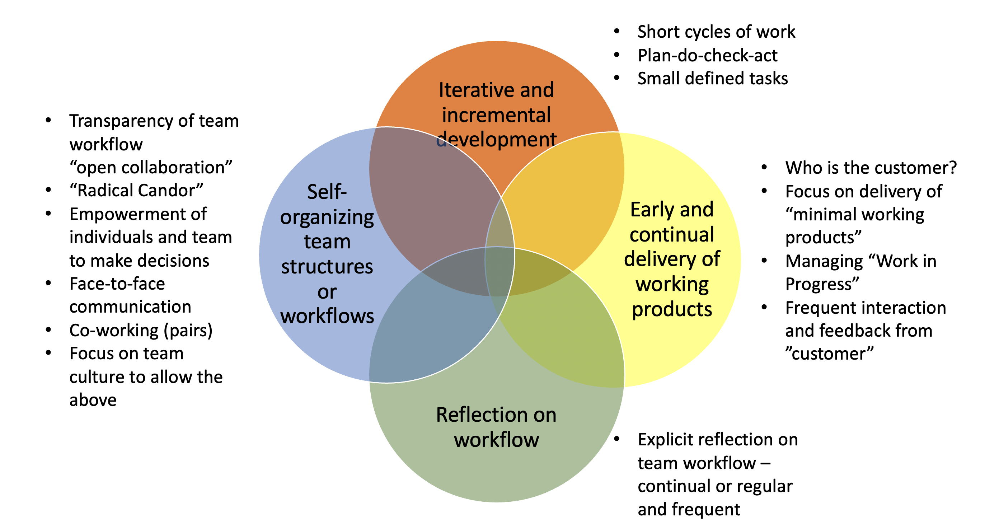

## What it is not: Waterfall

Let's imagine that we are preparing a big report or perhaps we have put in a, successful, proposal for a new big modeling project to address some management issue.

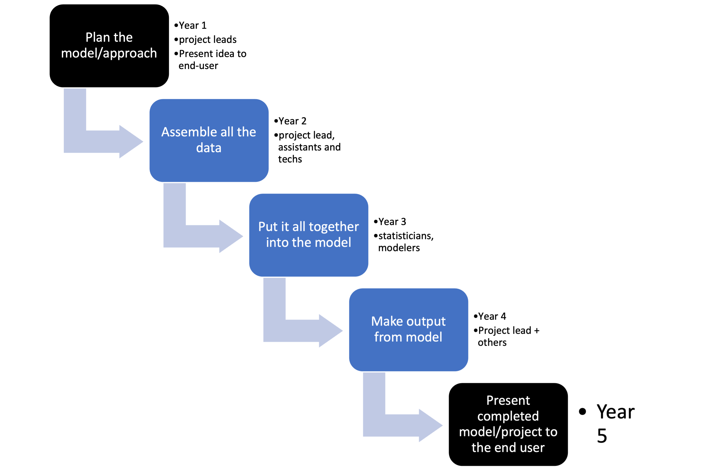

Or for a research project it might look like:

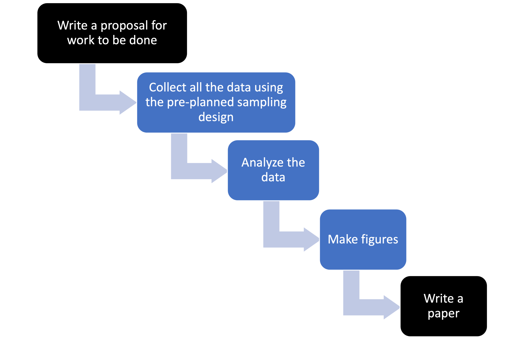

A key feature of the 'waterfall' approach is "Big Design Upfront": you have a fully fleshed out plan for the project from start to finish. We come from academic backgrounds and the way we get funding forces us into the "Big Design Upfront" paradigm, aka a detailed research proposal that lays out what we are going to do and how.

## Originating ideas

### Industrial quality control

A key element of agile methodologies is iterative cycles, similar to the Plan-Do-Check-Act (PDCA) cycle:

{width=50%}

This was popularized by the work of W. Edwards Deming on how to design workflow and organizational systems that improve quality control, though the ideas are traced back to the 1930-50s with work on industrial quality control systems (e.g., Walter A. Shewhart cycle) and earlier ideas on the scientific method.

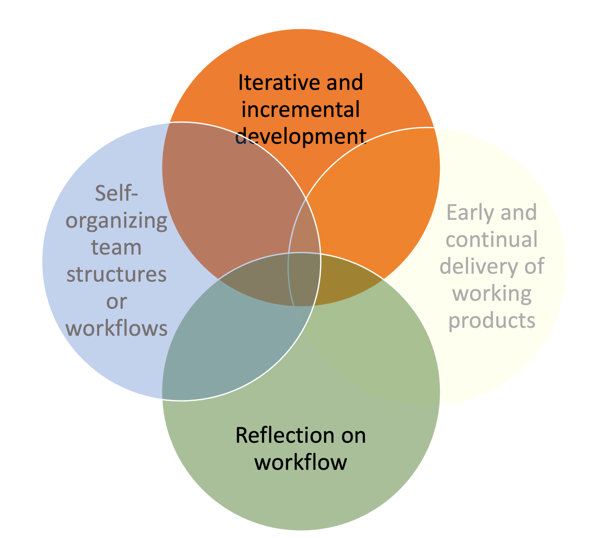{width=50%}

### Lean manufacturing

Despite the name, "lean manufacturing" refers to a profound change in the structure and culture of manufacturing teams to a flat hierarchy with a intense focus on empowering of and continually learning by individual team members combined with systems (workflows) that are self-organizing, self-correcting, and spontaneously continually improving. 

The origin of these ideas is again credited to W. Edwards Deming ("Out of the Crisis: quality, productivity and competitive position" 1982. MIT Press Books), but adopted earliest in Japan where he visited to train Japanese engineers in quality control in the post-WWII period. These ideas were applied in the Japanese auto industry and written about in The Toyota Way (2003) by Jeffrey Liker and Toyota Kata (2009) by Mike Rother.

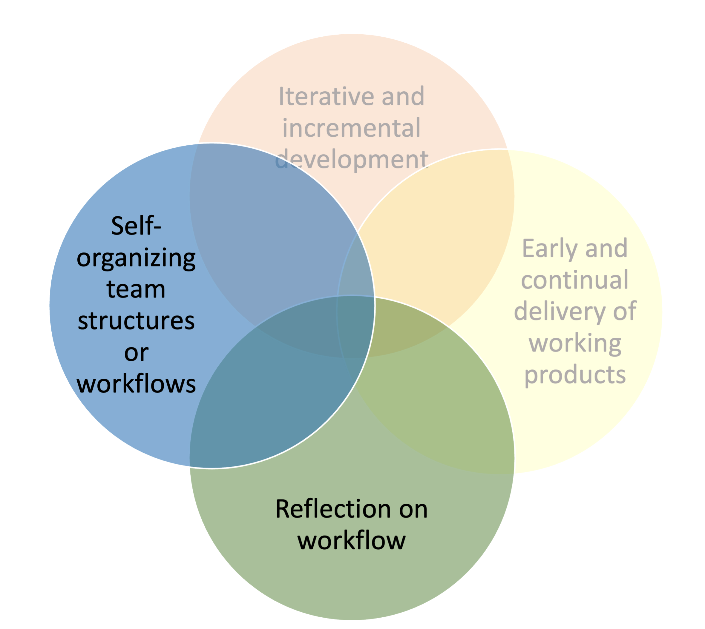{width=50%}

### Rapid application development theory

Lastly, agile is related to work on frameworks for rapid innovation for software applications developed in the 1980s (Barry Boehm, James Martin, James Kerr). By definition, innovation is creating something novel so you can't write a plan to get to the "product" because you don't know what the product is. Because the customer (who you don't yet since you are developing something new) has never seen the product, the design process is organic and knowledge gained from the development process itself affects the design at each cycle.

* Rapid iterations with learning
* Working demos (prototypes)
* Tight collaboration with "customer"
* Team culture: autonomous teams where members plan their own work and work their own plans.

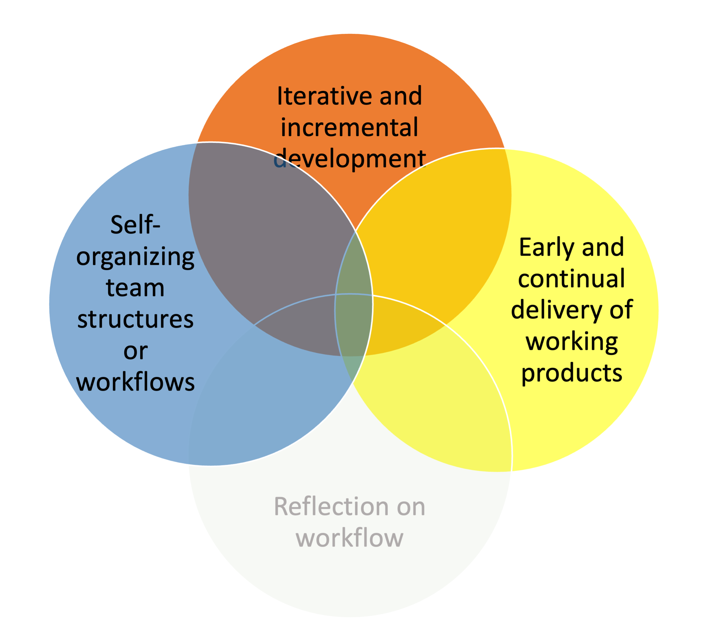{width=50%}

## Evaluating your workflow

| Question                                                                                              | Score 1 to 10 | Values                       |
|-------------------------------------------------------------------------------------------------------|:-------------:|------------------------------|
| How often does the team check-in to discuss what they are working on? Daily, weekly, monthly, yearly, never?                                     |               | Individuals and interactions |
| Everyone on the team knows roughly what everyone else is doing at any time. 1=noone has any idea, 10=we can all see each others tasks and status.                        |               | Individuals and interactions |
| Team members have autonomy and ability to work on tasks of interest and skill.                        |               | Individuals and interactions |
| At regular intervals, the team reflects on how to become more effective  and adjusts
its behavior. 10=never, 5=yearly, 1=biweekly |    | Individuals and interactions |
| At any point in time, we can show a working version of something.   Only when done, sometimes, most of the time.                                  |               | Working software             |
| Once you start, how long is it until you can show something to the customer? 1=week, 10=year          |               | Working software             |
| Do you have regular and early opportunities for the customer to give feedback and change the project? |               | Customer collaboration       |
| Is the customer a part of the team?                                                                   |               | Customer collaboration       |
| Can your project change or are you locked into a plan?                                                |               | Responding to change         |
| Do you assume that the project will change and plan for that or is it a bad outcome?                  |               | Responding to change         |

# Agile methodologies

What makes an "agile" methodologies?

* customer focus – we keep in mind our target customer
* incremental - we work in small **functional** chunks, which means we don't start and then leave tasks in undone states, we don't multi-task and work on many things all at once.
* collaboration – we implement workflows and use frameworks to work openly together not individually at the same time
* reflection – we implement regular team reflection to realize continuous improvement
* respect – we use forms of team interaction that actively accommodate differences of opinion and approach
* simplicity - we focus on getting the important things done first and quickly


## Kanban

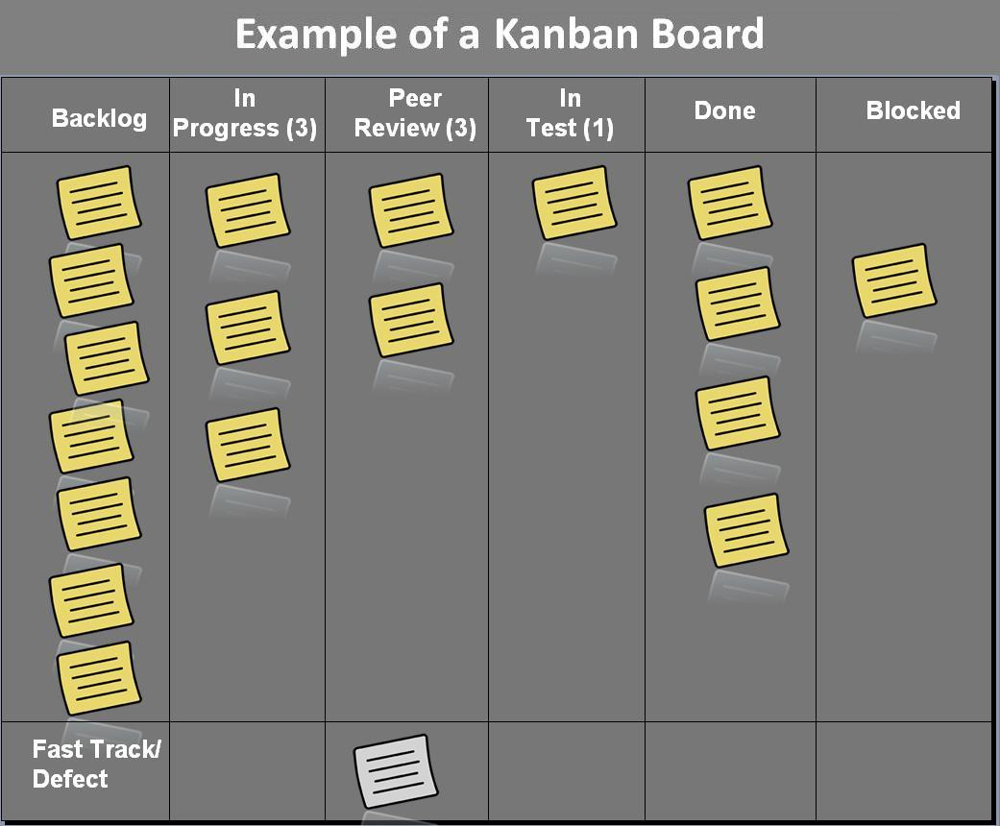

Kanban is an approach to project management that allows the whole team to visualize the project workflow.

* transparency -- visual representation of the team's workflow
* iterative and incremental -- each task is a well-defined task (ca 1-2 days to move columns)
* "workable product" -- minimize work in progress and focus on finishing tasks before taking on new tasks
* problems with task "flow" are addressed as they arise

No "sprints", time-boxed tasks, or time targets. 

Classically Kanban boards are used for tasks that come in regularly rather than a project task board where you curate a backlog of planned tasks.

* Atlassian has a nice Kanban video series: [intro](https://www.youtube.com/watch?v=iVaFVa7HYj4), [designing your Kanban board](https://www.youtube.com/watch?v=Bcid33tgq8A), [work in progress limits](https://www.youtube.com/watch?v=zEJn6eQO6FE), [writing kanban cards](https://www.youtube.com/watch?v=PxXdcQrPIUI)

## Kanban with GitHub

This is the default template in GitHub Project Boards.

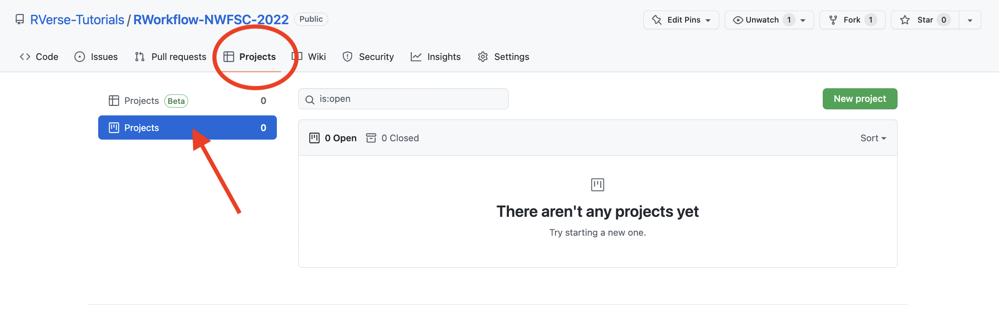

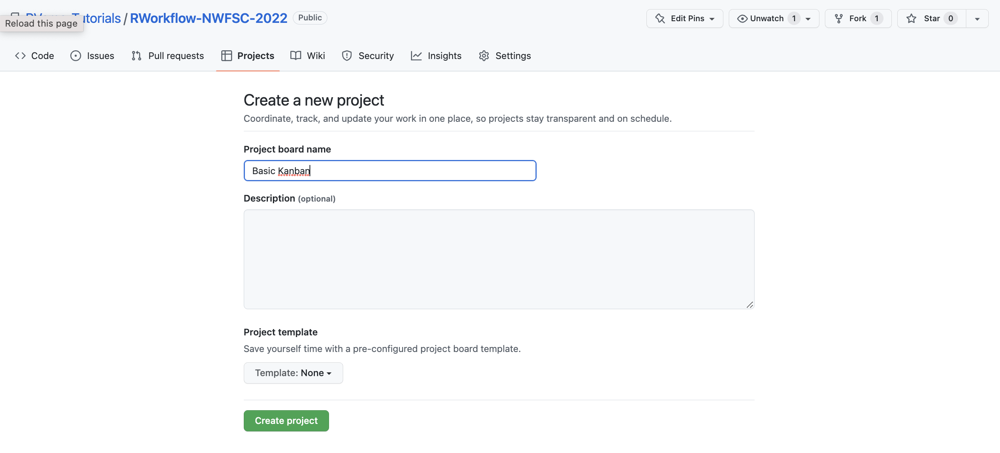

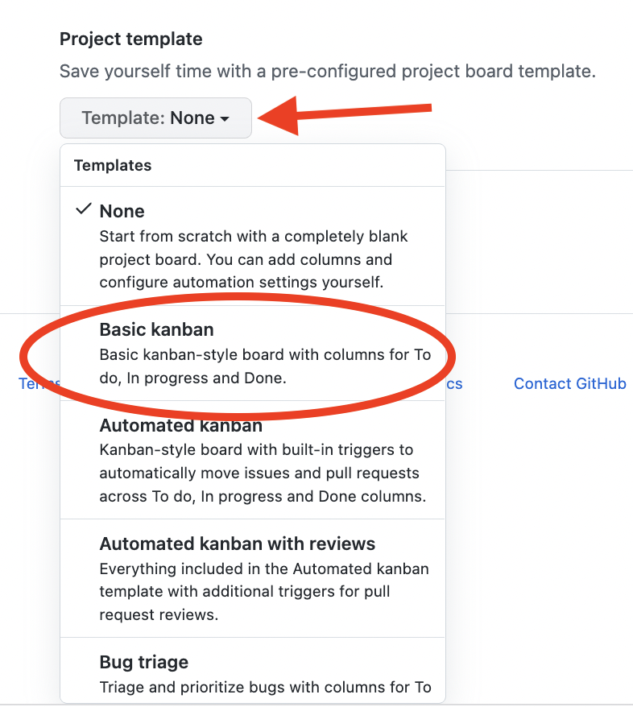{width=25%}

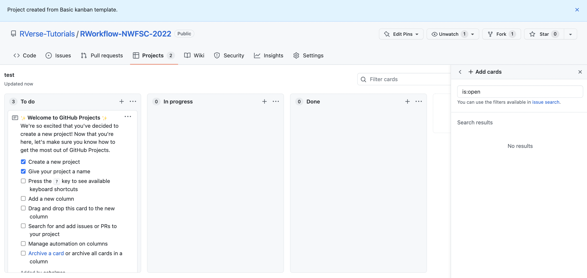

#### Adding tasks or issues

You can manually add cards and put tasks on the card.

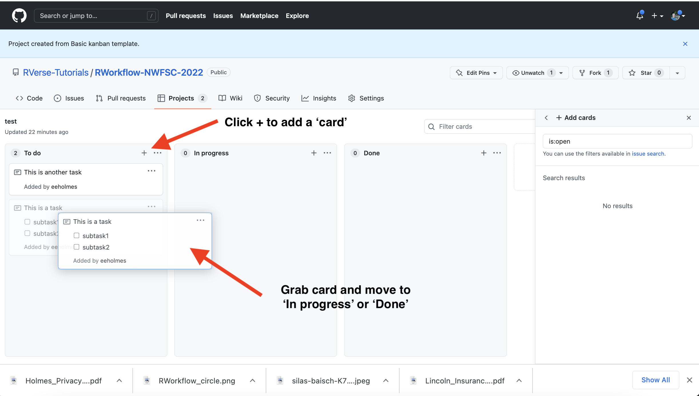
You can add issues (issues tab in GitHub) and then add those issues to the project board. Why use issues? Issues offer much more functionality and can be linked to commits to the repository.

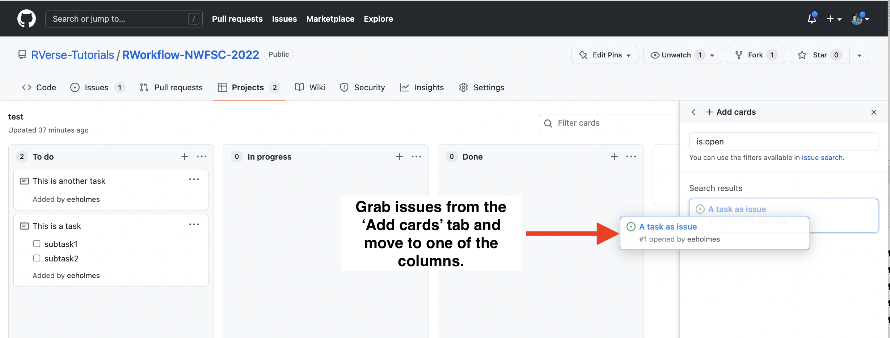

### Automation of your Kanban board

#### Use GitHub's automation

* Click `...` on a column to add
* Make sure to select project when you add an issue

#### Use a plug-in

https://github.com/philschatz/project-bot 

First column must have
```
###### Automation Rules

<!-- Documentation: https://github.com/philschatz/project-bot -->

- `new_issue`
- `reopened_issue`
```

Then you can use automation to move around the cards
```
###### Automation Rules

<!-- Documentation: https://github.com/philschatz/project-bot -->

- `milestoned_issue` **3.11.4**
```

## Why use a Kanban board?

Visualize the flow of work so that we can improve it incrementally and organically--meaning no fixed framework. Just seeing your workflow helps you see the problems.

* Promote transparency - we see what team is doing
* Facilitate collaboration – by seeing what we are all doing
* **Finish tasks** - shows you if you have a huge 'work in progress' list
* Visualize problems, e.g. tasks that are in "in progress" forever.
* Especially helpful if there is a natural flow to the work: write function, write documentation, write test, done

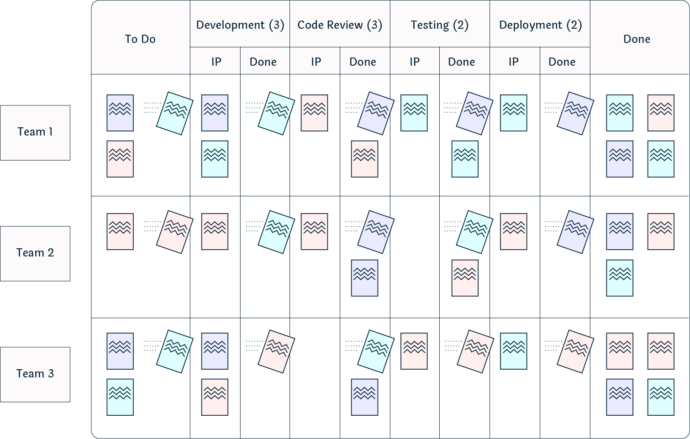


