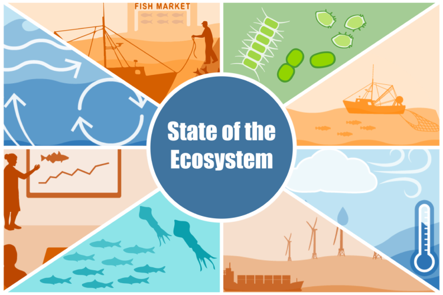
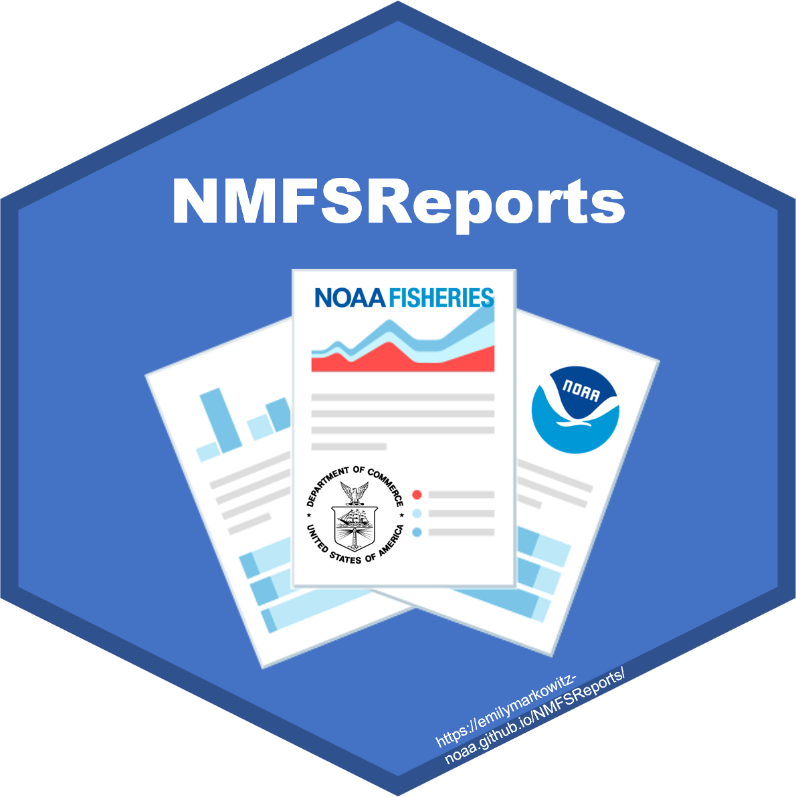

```{r setup, include=FALSE}
knitr::opts_chunk$set(echo = TRUE)
```

This week will shift gears and talk about writing reports using R Markdown.

## Overview

R Markdown is a format that allows you to combine text and R code.  From RStudio you can output your file in many formats: html, PDF, Word, presentations.  We are exploring a small slice of R Markdown.  
If you have never worked with R Markdown, start with RStudio's online lessons. That'll get you up to speed with the basics.
[RStudio R Markdown lessions](https://rmarkdown.rstudio.com/lesson-1.html)

When you are ready to explore more, go to this great R Markdown resource [R Markdown for Scientists](https://rmd4sci.njtierney.com/). [The R Markdown Definitive Guide](https://bookdown.org/yihui/rmarkdown/) is also a good resource.

### What about Quarto?

[Quarto](https://quarto.org/) is also created by RStudio and is the "next-gen" R Markdown. If you are just starting out, just stick with R Markdown. Quarto is back compatible with R Markdown. But going forward, everyone will be switching to Quarto. I've started converting my easy websites and simple online documentation to Quarto. It's not hard. *Note the material here will work for Quarto*.

## R Markdown for reports

There are many on-line tutorials for R Markdown which will cover the basics. I'll focus on some of the aspects of R Markdown related to creating the types of reports that we generate in NOAA Fisheries (and other agencies). These often are reports that have a standard format but use different data sets or that generate the same table or figure with different data (species, gear, location, etc). Automating the generation of these reports can really speed up your work: 

Part 1 today

* orientation
* automating the making of tables and figures
* duplicating tables or figures by looping over a variable
* documenting the data used in a report
* math
* presentations

Part 2 tomorrow

* putting the pieces together for a report
* table of contents
* Word templates to change look and formatting
* pulling in content from Google Docs or Spreadsheets

## Set-up for today

Today I will use RStudio Cloud so you can follow along without having to install any packages or TeX (for PDF generation).

[Click here](https://rstudio.cloud/content/4288342) and sign in with a Google account (any one you want) to follow along. You can also make an account. 

### Running locally

If you want to follow along on your computer, then create a RStudio project using this repo https://github.com/RVerse-Tutorials/Rmarkdown-Tutorial.git

* You can download a zip file of the repo and create an RStudio project from that folder
* Or if you are set up with Git, you can use the link to create an RStudio project with the files

**Note** If you are using RStudio on your own computer, there are some packages that you'll need: {rmarkdown}, {knitr}, {kableExtra}, {flextable}, {ggplot2}, {xtable}.

To make PDF files you will need a LaTeX installation.  If you don't have one already (if you are not sure, then you don't), you can install [tinytex](https://yihui.name/tinytex/).  Run these lines:

```
install.packages('tinytex')
tinytex::install_tinytex()
```

## Build your first R Markdown file

* Open RStudio, and click File > New File > R Markdown... . 
* Select the default (document) and click ok. This will open a template R Markdown document. 
* Save the file and then click 'Knit' in the nav bar above your template. 
* Download the necessary packages if RStudio complains and won't build.


Note the first time you make a PDF, {tinytex} will load any needed packages and it can take a **long** time. You'll see a spinning wheel on the R Markdown tab.

Note, if you are using RStudio Cloud, I have installed all these things for you.

## YAML

Open up `Basic.Rmd`.  

At the top you see

```
---
title: "Basic"
author: "EE Holmes"
output: html_document
---
```

This is the `yaml` which gives the instructions about how to process your R Markdown file.  The `yaml` file is sensitive to spaces.  Do not add or subtract spaces.  This `yaml` is very simple, but the `yaml` can be complex for some applications.  We will only be working with simple examples.

After the `yaml` is the content.  To see a summary of R Markdown formating, click 'Help' menu and then 'Markdown Quick Reference'.

## Formats

We can create documents in different formats from this Rmd file.  Click the drop-down menu next to the 'Knit' button.

* **HTML** Select 'knit to HTML' to create a web document.
* **Word** Select 'knit to Word' to create a Word document.
* **PDF** Select 'knit to PDF' to create a PDF. Note need for a LaTeX installation (easiest is tinytex).

Try creating an Rmd file File > New File > R Markdown... and see the templates that are offered.

## Getting help

In RStudio, click the 'Help' tab in the top nav bar.  You will see 'Markdown Quick Reference'.  That has basic markdown syntax.  You can also click 'Cheatsheets' and there are two references sheets.   Using Google, you can also find answers to any questions that the RStudio help files doesn't answer. See also [R Markdown for Scientists](https://rmd4sci.njtierney.com/).

Tips:

* Markdown is sensitive to leading spaces.  "  ## Topic" will not produce a header while "## Topic" will.  " ```{r}" (note leading space) will not be interpreted as R code.
* Markdown is sensitive to line returns.  If you are tying to make a list, "1. item", then you must have two line returns before the "1. item".


## Figures

* Figures `Figures.Rmd`
* Figures in a for loop and side by side `Figures_for_loop.Rmd`

## Tables

* Tables `Table.Rmd`
* Tables for Word, html, or latex `Table_Extras.Rmd`
* Tables in a for loop `Tables_for_loop.Rmd`
* Making tables using a function. This allows you to make the same table but with different data. A common example would be making a standard table for each species or each population in a dataset. "Report with Tables" folder shows you how to do that. Start with the README file.

## Presentations

* **ioslidy_presentation.Rmd** Choose File > New > R Markdown > ioslidy presentation to create this presentation template.
* **xaringan_presentation.Rmd** You will need to install the **xaringan** package.
* Templates with branding
    - https://github.com/nmfs-openscapes/xaringan-nmfs [Demo1](https://nmfs-openscapes.github.io/xaringan-nmfs/docs/template.html#1) &#10070; [Tufte demo](https://nmfs-openscapes.github.io/xaringan-nmfs/docs/template-tufte.html#1)
    - https://github.com/nmfs-fish-tools/presentations

## Extras

* Math `Math.Rmd`
* Table of contents and Code folding  `Extras.Rmd`


## Fisheries reports using R Markdown

Here are some real examples of NOAA Fisheries reproducible reports created with R Markdown. 

* Northeast US State of the Ecosystem reports, and technical documentation: [Website with links to reports](https://www.fisheries.noaa.gov/new-england-mid-atlantic/ecosystems/state-ecosystem-reports-northeast-us-shelf), [GitHub repo for Mid Atlantic report](https://github.com/NOAA-EDAB/SOE-MAFMC) &#10070; [GitHub repo for New England report](https://github.com/NOAA-EDAB/SOE-NEFMC) &#10070; [GitHub tech doc repo](https://github.com/NOAA-EDAB/tech-doc) &#10070; [K Bastille paper on the report and process](https://www.tandfonline.com/doi/full/10.1080/08920753.2021.1846155) &#10070; [K Bastille presentation](https://noaa-edab.github.io/presentations/20211015_Openscapes_Bastille.html#1)

* [Atlantic Offshore Wind Development Socioeconomic Reports](https://www.fisheries.noaa.gov/resource/data/socioeconomic-impacts-atlantic-offshore-wind-development) These reports are all done in R Markdown. You can see how they use a standard format. 

* [{sa4ss} R package](https://github.com/nwfsc-assess/sa4ss) for creating stock assessment documents for the Pacific Fishery Management Council. The package provides (1) a consistent structure, (2) generic text that should be the same across all stocks, (3) embedded functionality to create an accessible pdf that satisfies NOAA's guidance for 508 compliance, and (4) increased speed compared to creating a word document from scratch.

* [{NMFSReports} R package](https://emilymarkowitz-noaa.github.io/NMFSReports/) The NMFSReports Package has all of the basic architecture you need to create reproducible and repeatable NOAA Tech Memos in R Markdown! This approach is perfect for efficiently rolling out annual (or other regular) reports or reports with formulaic sections (the same chapter structure but for a different area or species). Scripts integrate table, figure, data, and bibliography management and design automation.


## More Rmd examples

* Websites: The workshop website is built off Rmd files. See the [website](https://rverse-tutorials.github.io/RWorkflow-NWFSC-2020/websites.html) tutorial to learn how to do this. It is super easy.
* Online books using bookdown: Books [like this one](https://atsa-es.github.io/atsa-labs/) for our time-series course are easy to make using Rmds. See the [bookdown](https://rverse-tutorials.github.io/RWorkflow-NWFSC-2020/bookdown.html) tutorial to learn how to do this. Again super easy.
* Create a spiffy landing page for your repository: Like this one for our [NMFS R User Group](https://nmfs-openscapes.github.io/NMFS-R-UG/). Made with the {postcards} and {distill} packages.
* A journal article repo. [Journal Article](https://github.com/RVerse-Tutorials/Journal_Article) This shows you a realistic repository for a journal article. I've cut out many paragraphs here and there to shorten it, but it is still has all the parts. The repository is a self-contained paper with all the data and the analyses are redone completely whenever `Main.Rmd` is re-knit. So if the data change, all the analyses will be updated.
* Making tables using a function. This allows you to make the same table but with different data. A common example would be making a standard table for each species or each population in a dataset. [Report with Tables](https://github.com/RVerse-Tutorials/Rmarkdown-Tutorial/tree/master/Report_with_Tables) shows you how to do that. Start with the `README` file.

## Figure and Table numbering

Automatic figures and table numbering for a paper or a report is a hassle with R Markdown. Here is my [solution](https://stackoverflow.com/a/47298632/10947238). The Journal Article repo uses this method. *2022: last I checked people were still using this method, but I suspect that this will be solved in the future.*

## Accessibility

Knitting in RStudio by clicking the Knit button uses `rmarkdown::render()` which will automatically produce an html document that is more accessible than other ways that you might knit a R Markdown document. However you'll need to do some special things to add alt info to figure in the html, specifically add a figure caption.

### Adding figure alt text

If you don't need to have figure captions or if you are ok with the figure legend and alt text being the same, they adding alt text for figures is quite easy.

**Figure caption displayed and alt text will be the same**

```{r fig.cap="This will be the alt text"}
plot(1:10)
```

**No figure caption displayed**

Add this to the top of your Rmd (or save to a css file and put that in the yaml) and the figure caption will not show up in your html.

```
<style>
    .caption {
        display:none;
    }
</style>
```

**Use html**

Another approach is to have R Markdown save your figures, and then insert those with html. Then you have full control over the caption, alt text and can add the longdesc tag also.

### Adding table captions

You can use `caption=` with `knitr::kable()` to add captions.

```{r}
knitr::kable(cars[,1:2], caption="This will be the Table caption")
```

**No table caption displayed**

Add this to the top of your Rmd (or save to a css file and put that in the yaml) and the table caption will not show up in your displayed html but will still be there for accessibility.

```
<style>
    caption {
        display:none;
    }
</style>
```

### Accessibility resources

[NMFS R UG session on 508 Compliance and R Markdown](https://github.com/nmfs-openscapes/10-26-21-508-Compliance/blob/main/README.md) Take a look at the [{sa4ss} R package](https://github.com/nwfsc-assess/sa4ss) which has accessibility functionality added. 

https://r-resources.massey.ac.nz/rmarkdown/

**Latex (PDF)***

Making accessible PDFs is harder in LaTeX. You might look at the [tagpdf](https://www.ctan.org/pkg/tagpdf). 

Another option is to have R Markdown save the figures, and use LaTeX:

```
\begin{figure}
    \centering
    \includegraphics{fig1.png}
   \Description[short desc]{long description}
   \caption{the caption}
   \label{fig:fig1}
\end{figure}
```


