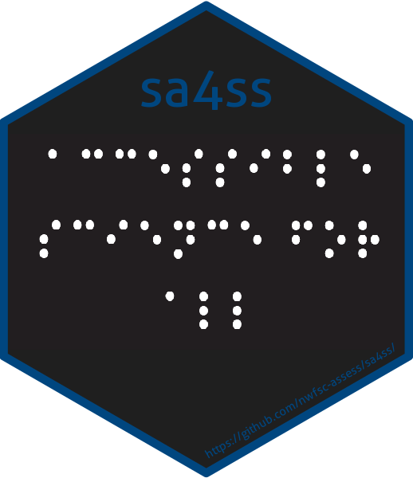

```{r setup, include=FALSE}
knitr::opts_chunk$set(echo = TRUE)
```

This week will shift gears and talk about writing reports using markdown via Quarto (the next-gen R Markdown). There are many on-line tutorials for R Markdown (which is compatible with Quarto) which will cover the basics. I'll focus on some of the aspects that can really speed up your work:

-   automating the making of tables and figures
-   duplicating tables or figures by looping over a variable
-   using Work templates to change the look and formatting

AND today I will show Quarto, which fixes many of the things that were hard with R Markdown reports. Note Quarto is part of RStudio 4.2.1 now; not a separate software that you have to install.

### Today's topics

* [Quatro book](https://quarto.org/docs/books/) orientation. Book is what we want for a big report with multiple chapters.
* How to tackle your big report: strategy and workflow.
* A repo set up to do a big report with lots of tables, list of figure and tables, figures, references, etc.

## Intro to R Markdown/Quarto?

Today is not an intro lecture. I am focusing on big reports with Quarto/R Markdown.

### How do I learn R Markdown?

-   Google "R Markdown tutorial". There are so many.
-   In RStudio, go to File \> New File \> R Markdown... to create a blank template. Click Knit in the in the navbar (icon is a ball of yarn).
-   In RStudio, click Help \> Cheatsheets. Start there and learn by doing.
-   Next, start copying from your colleagues who post on GitHub and use R Markdown/Quarto. Look for the GitHub icon on their online material to see source code.

## Set-up

I will be using RStudio Cloud so that you can follow along and you won't have to install anything.

But when you are ready, upgrade (or have your IT upgrade) RStudio to the latest version. Then do New Project (little arrow in top right) -\> New directory -\> Quarto xyz (choose any you want to play with). Then click Render and install any necessary packages. Note RStudio now installs {tinytex} (fingers crossed) so rendering to PDF should work.

## Let's dive in!

-   Go here [hello_quarto_book RStudio Cloud workspace](https://rstudio.cloud/content/4322267) and log in with a Google account (or your own account if you have one).
-   Follow along with me.

### Structure

* `index.qmd` file. Our first page. Must have this.
* `.qmd` files. Our content. Chapters etc.
* `_quarto.yml` file. How to put our chapters together.
* `references.bib`

### Knit to different formats

* Word, PDF, HTML are defaults. *I had to add `docx: default` to `_quarto.yml`
* You can customize this as you wish.

### Adding content

I am going to use the visual editor mostly, though I'll jump to the source code as needed.

* Text
* Figures + cross-references
* Tables + cross-references
* References

## How did I set up the Quarto book workspace and repo?

In RStudio Cloud, I can easily create Quarto (qmd) documents, but what I am showing today is a Quarto project. I don't think I can do that (yet) in RStudio Cloud, so let me show you how I created what you see at the [hello_quarto_book RStudio Cloud workspace](https://rstudio.cloud/content/4322267).

-   Open RStudio on my laptop. I have RStudio 2022.07.1+554 for Intel Mac (not M1) installed on my M1 Mac Air.
-   File \> New Project \> New Directory \> Select Quarto book from the templates. Select to make it a Git repository.
-   This creates a project everything set up for a Quarto book
-   *I did add some extra bib entries to `references.bib`.*
-   Then I published this new repo on GitHub.
-   Then I opened RStudio Cloud, clicked new workspace and clicked "from Git repository". Default sharing is private, so I clicked on the little lock icon to change that to public.

<details>

<summary>The exact steps for publish to GitHub step</summary>

Next I pushed this new Git repo up to GitHub and the RVerse GitHub organization. This is my actual work (as opposed to teaching) workflow. \* First I added a main branch because RStudio doesn't do that by default (???). Click on the Git tab, look for the branch icon (diamond with some rectangles), add a branch called main. \* Then I switched to GitHub Desktop. added the repo in GitHub Desktop. File \> Add local repository. \* Now a button to Publish to GitHub pops up (in GitHub Desktop top nav bar) and I clicked that. \* Now everything is synced up to GitHub.

Note, I teach the following workflow: Create repo on GitHub and **make sure to check the button to add Readme file**. Clone that repo onto your computer via GitHub Desktop or RStudio, say. Add your new files to the clone on your computer. Push changes up to GitHub. *Why do I teach it this way?* It is basically bombproof and the last thing you want when learning to work with Git is tie yourself in knots. It uses only the 3 core Git+GitHub skills that I teach so no need to learn more stuff.

</details>

## A government report

Follow along on [RStudio Cloud](https://rstudio.cloud/content/4308300)

### Get organized

#### General set-up

* Be as modular and simple as you can. 
* Don't make everyone in your team be the markdown/Quarto wizard. You only need one person to build the framework.
* Use simple child qmd (or Rmd) files so that other team members work only on simple qmd/Rmd flat files.
* Copy reports built by others who are doing something similar to you. TALK within your center or across centers and share work.

#### Plan figures and tables

Putting raw code for figures and tables in your documents is not a good long-term strategy. Saves time now (maybe) but equals suffering and wasted time later.

* **Plan what types of figures or tables you need**
* Write a separate qmd/Rmd files, script or functions.
* Try to be modular rather than custom figures and tables for every use.
* Don't put all your tables or figures in one huge file: `Table xyz.Rmd/qmd`, `Table abc.Rmd/qmd`. Have your dedicated markdown wizard figure out the automatic numbering.

<center>
*Note, in practice, you need a proto-typing phase while working on the report when tables and figures source code is in the chapter files. Try to move out of that sooner than later.*
</center>

### Cross-references

This used to be horribly and is now easy with Quarto.

For example, we can make a figure with the chunk label `fig-plot` like so. You must use the `fig-` prefix.

````{verbatim}
```{r}
#| label: fig-plot
#| fig-cap: "Plot"

plot(cars)
```
````

The later in the text we use `@fig-plot` to get @fig-plot.

```{r echo=FALSE}
#| label: fig-plot
#| fig-cap: "This is a plot of some data"

plot(cars)
```

See the [Quarto cross-ref page](https://quarto.org/docs/authoring/cross-references.html) for how to do cross-references for images, figures, and table.

### References

This used to be hard. Now easy with Quarto. Go into visual mode and type `@` and it'll auto-suggest based on your `.bib` files in your project or any Zotero bibs you have on your computer. Or you can paste in a DOI and it'll add that to your references.

### Chunk labels

Don't duplicate chunk labels across your documents.

When using Quarto (or R Markdown), it is best not to use chunk labels in the your Rmd/qmd children unless you need to for figures and tables. It's too easy to get duplicate labels accidentally.

### File paths

* If you need to reference a file in a folder, let R create the path so that it is compatible across operating systems.
```
file.path('figures', 'figure1.Rmd')
```
* I use the {here} package so that my code doesn't break if I happen to issue a change workspace directory command.
```
here::here('images', 'logo.png')
```
This way if you have a reference to an image in the `images` folder at the base level of your project, you can move the document anywhere deep into some folders, and it'll still find the image.

### Tables in for loops

Making tables within `for` loops is tricky and it is different if you are outputting to Word versus html and also depends on what package that you use. See my qmd/Rmd files in the tables folder for examples of how to set it up.

### Working with Word

For many of us, Word is part of our team's workflow. Here are some tips if that is the case for you:

* Check out the [officeverse](https://ardata-fr.github.io/officeverse/index.html): [officedown](https://CRAN.R-project.org/package=officedown) and [flextable](https://CRAN.R-project.org/package=flextable) R packages.
* Quarto has greatly [improved Word](https://quarto.org/docs/output-formats/ms-word.html) integration so many of the problems we faced with Word output may soon be solved.
* Use templates to make your Word doc look the way you want. The default Word template is bare bones. See my example and read about using Word templates with Quartro [here](https://quarto.org/docs/output-formats/ms-word-templates.html) and R Markdown [here](https://bookdown.org/yihui/rmarkdown-cookbook/word-template.html).
  
#### Nice tables in Word

The example in `Table_Counts.Rmd` and `Table_Counts_flex.Rmd` shows you tricks to make nice Word tables.

* how to include a page break in your Word doc between tables. 
* using `format="pandoc"` for the table
* using `results='asis'` and `print()` so you can use `for` loops.
* centering your tables is next to impossible with `kable()`. Use the {[flextable](https://ardata-fr.github.io/flextable-book/)} package if you need that.

#### New pages in Word

This is how to get a new page in Word. Make sure you are in print view on the word doc, otherwise you won't see any of the pages.

```{r echo=FALSE, comment=""}
cat('```{=openxml}\n<w:p><w:r><w:br w:type="page"/></w:r></w:p>\n```')
```

```{=openxml}
<w:p><w:r><w:br w:type="page"/></w:r></w:p>
```

### PDF templates

* Use document classes.
* Quarto makes it easier to pass in class options.
* See [Quarto PDF guide](https://quarto.org/docs/output-formats/pdf-basics.html)


## Fisheries reports using R Markdown

Here are some real examples of NOAA Fisheries reproducible reports created with R Markdown. 

* Northeast US State of the Ecosystem reports, and technical documentation: [Website with links to reports](https://www.fisheries.noaa.gov/new-england-mid-atlantic/ecosystems/state-ecosystem-reports-northeast-us-shelf), [GitHub repo for Mid Atlantic report](https://github.com/NOAA-EDAB/SOE-MAFMC) &#10070; [GitHub repo for New England report](https://github.com/NOAA-EDAB/SOE-NEFMC) &#10070; [GitHub tech doc repo](https://github.com/NOAA-EDAB/tech-doc) &#10070; [K Bastille paper on the report and process](https://www.tandfonline.com/doi/full/10.1080/08920753.2021.1846155) &#10070; [K Bastille presentation](https://noaa-edab.github.io/presentations/20211015_Openscapes_Bastille.html#1)

* [Atlantic Offshore Wind Development Socioeconomic Reports](https://www.fisheries.noaa.gov/resource/data/socioeconomic-impacts-atlantic-offshore-wind-development) These reports are all done in R Markdown. You can see how they use a standard format. 

* [{sa4ss} R package](https://github.com/nwfsc-assess/sa4ss) for creating stock assessment documents for the Pacific Fishery Management Council. The package provides (1) a consistent structure, (2) generic text that should be the same across all stocks, (3) embedded functionality to create an accessible pdf that satisfies NOAA's guidance for 508 compliance, and (4) increased speed compared to creating a word document from scratch.

* [{NMFSReports} R package](https://emilymarkowitz-noaa.github.io/NMFSReports/) The NMFSReports Package has all of the basic architecture you need to create reproducible and repeatable NOAA Tech Memos in R Markdown! This approach is perfect for efficiently rolling out annual (or other regular) reports or reports with formulaic sections (the same chapter structure but for a different area or species). Scripts integrate table, figure, data, and bibliography management and design automation.

* [Fisheries Economics of the United States](https://www.fisheries.noaa.gov/national/sustainable-fisheries/fisheries-economics-united-states) The 2016-2019 reports were produced with R Markdown. This shows you that you can customize the output of your reports to achieve a specific, and uniform, formating.


The RStudio Cloud workspace (above) is cloned from <https://github.com/RVerse-Tutorials/hello_quarto_book>

[this link](https://rstudio.cloud/content/4308300). The example qmd files are in <https://github.com/RVerse-Tutorials/QmdReport>.
